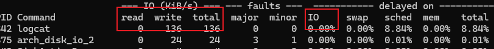
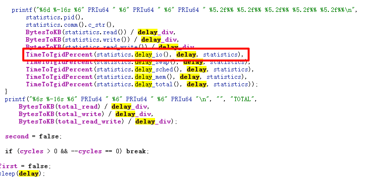
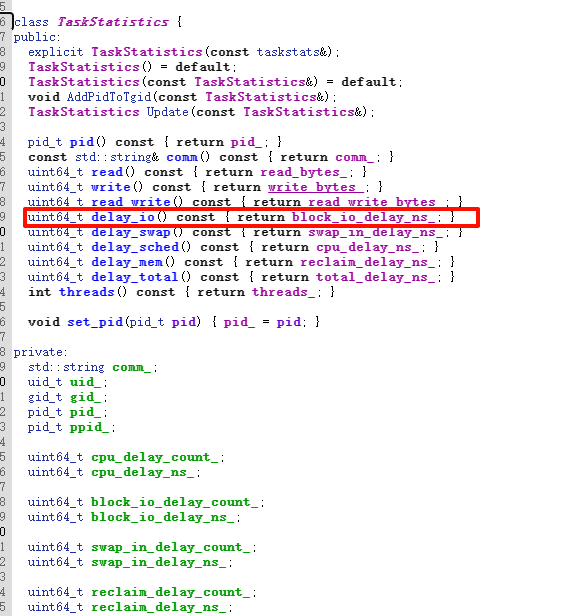
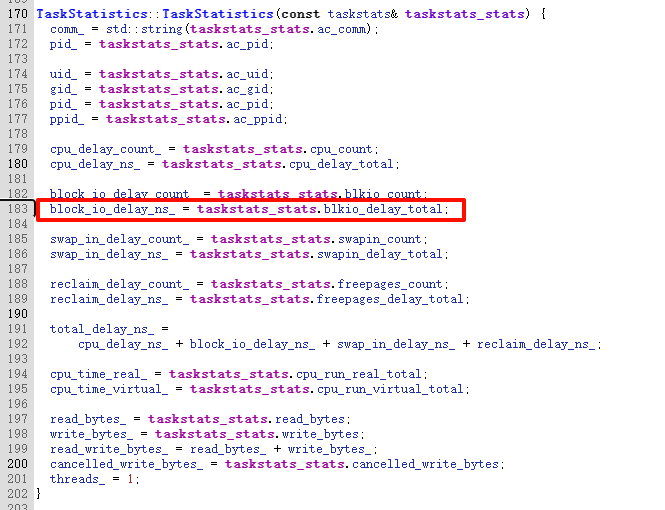

之前工作中需要模拟iotop获取进程的io信息。

iotop这个命令中，可以获取到进程的读写字节数，以及IO使用情况。


查阅资料后发现，在linux中，进程的io信息都存放在`/proc/进程号/io`文件中。
读取数据可以得到如下内容
```shell
rchar : xxxx
wchar : xxxxxx
syscr : xxx
syscw : xxxx
read_bytes : xxx
write_bytes : xxxx
cancelled_write_bytes : xxx
```

各个字段的含义为：

**rchar**:  读出的总字节数，read或者pread（）中的长度参数总和（pagecache中统计而来，不代表实际磁盘的读入）

**wchar**: 写入的总字节数，write或者pwrite中的长度参数总和

**syscr**:  read（）或者pread（）总的调用次数

**syscw**: write（）或者pwrite（）总的调用次数

**read_bytes**: 实际从磁盘中读取的字节总数   （这里if=/dev/zero 所以没有实际的读入字节数）

**write_bytes**: 实际写入到磁盘中的字节总数

**cancelled_write_bytes**: 由于截断pagecache导致应该发生而没有发生的写入字节数（可能为负数）

简单的想获取read和write字节数，可以通过read_bytes和write_bytes（配合cancelled_write_bytes）来获得。

设置好单位时间，在单位时间前获取一项数据old_data，单位时间后获取一项数据new_data。二者做差就可以得到不同进程在单位时间内的读写字节数。

但是，如何计算IO呢？

# 如何计算IO
先说我的解决办法：

可以在 `proc/[pid]/sched`中的字段 : statistics.iowait_sum读取到累计IO阻塞时间。

再利用单位时间内的IO阻塞时间的变化量 除以 单位时间，得到IO占用率。

# 引申：iotop中的IO是什么意思？

可以查阅：[iotop的安卓源码](http://androidxref.com/9.0.0_r3/xref/system/extras/iotop/iotop.cpp#make_sorter)

在源码中可以发现，其IO数据是 ： `delay_io()`，`delay` 等计算而来



其中，其计算的百分比方法为：

```cpp
static float TimeToTgidPercent(uint64_t ns, int time, const TaskStatistics& stats) {
  float percent = ns / stats.threads() / (time * NSEC_PER_SEC / 100.0f);
  return std::min(percent, 99.99f);
}

// ns：进程或线程组的IO运行时间，单位是纳秒
// time：观察的时间段，单位是秒
// stats：这是进程（或线程组）的统计信息，其中stats.threads()返回进程的线程数
// 函数首先计算进程在每个线程上的平均 IO 运行时间，然后将这个时间除以总的观察时间，
// 并转换为百分比。
// 最后，函数返回这个百分比，但是如果计算出的百分比大于 99.99%，则返回 99.99%
```

**那么，关键在于：如何获取`delay_io()`呢？**

# 如何获取 `delay_io()`

结果发现，他是TaskStatisitics这个类中获得的。



类中直接获取到了一个数据：`block_io_delay_ns_`

## 如何获取 block_io_delay_ns_ ？

在taskstats.cpp中，发现了它的获取



所以关键变成：

## 怎么获取blkio_delay_total呢？

查阅了很多资料发现，linux中内核用户接口封装在include/linux/taskstat.h中

使用结构体taskstats能够使用户获取到内核中的进程统计信息。

taskstats是基于netlink的接口，

netlink是用户态和内核态之间的套接字（有点像socket）

linux中内核与用户空间数据交换的方式，有很多都是由用户态主动发起的。例如：系统调用、procfs、debugfs等等，这些通信方式都是同步通信方式。内核无法主动发起

而Netlink则提供了一组特殊的API接口，用户态基于socket API，内核发送的数据则会保存在接受进程socket的接收缓存中，由接受进程处理。

关于Netlink感觉还有很多需要学习，在这里先留个坑。

回到问题，如何得到`blkio_delay_total`呢？

查阅资料后发现，其再linux/kernel/delayacct.c中计算得到的.

```cpp
int __delayacct_add_tsk(struct taskstats *d, struct task_struct *tsk)
{
	cputime_t utime, stime, stimescaled, utimescaled;
	unsigned long long t2, t3;
	unsigned long flags, t1;
	s64 tmp;
	task_cputime(tsk, &utime, &stime);
	tmp = (s64)d->cpu_run_real_total;
	tmp += cputime_to_nsecs(utime + stime);
	// 保存cpu实际运行时间
	d->cpu_run_real_total = (tmp < (s64)d->cpu_run_real_total) ? 0 : tmp;
	
	task_cputime_scaled(tsk, &utimescaled, &stimescaled);
	tmp = (s64)d->cpu_scaled_run_real_total;
	tmp += cputime_to_nsecs(utimescaled + stimescaled);
	d->cpu_scaled_run_real_total =
		(tmp < (s64)d->cpu_scaled_run_real_total) ? 0 : tmp;
	/*
	 * No locking available for sched_info (and too expensive to add one)
	 * Mitigate by taking snapshot of values
	 */
	t1 = tsk->sched_info.pcount;
	t2 = tsk->sched_info.run_delay;
	t3 = tsk->se.sum_exec_runtime;
	d->cpu_count += t1;

	tmp = (s64)d->cpu_delay_total + t2;
	d->cpu_delay_total = (tmp < (s64)d->cpu_delay_total) ? 0 : tmp;

	tmp = (s64)d->cpu_run_virtual_total + t3;
	d->cpu_run_virtual_total =
		(tmp < (s64)d->cpu_run_virtual_total) ?	0 : tmp;

	/* zero XXX_total, non-zero XXX_count implies XXX stat overflowed */
	spin_lock_irqsave(&tsk->delays->lock, flags);
	tmp = d->blkio_delay_total + tsk->delays->blkio_delay;
	d->blkio_delay_total = (tmp < d->blkio_delay_total) ? 0 : tmp;
	tmp = d->swapin_delay_total + tsk->delays->swapin_delay;
	d->swapin_delay_total = (tmp < d->swapin_delay_total) ? 0 : tmp;
	tmp = d->freepages_delay_total + tsk->delays->freepages_delay;
	d->freepages_delay_total = (tmp < d->freepages_delay_total) ? 0 : tmp;
	d->blkio_count += tsk->delays->blkio_count;
	d->swapin_count += tsk->delays->swapin_count;
	d->freepages_count += tsk->delays->freepages_count;
	spin_unlock_irqrestore(&tsk->delays->lock, flags);
	return 0;
}
```

上面这段代码是linux内核中，用于更新taskstats结构体的函数

taskstats结构体用于存储进程或线程的统计信息。

可以关注到：
```cpp
tmp = d->blkio_delay_total + tsk->delays->blkio_delay;
d->blkio_delay_total = (tmp < d->blkio_delay_total) ? 0 : tmp;
```

两个结构体的数据

一个是使用`struct taskstats *d` 另一个是使用 `struct task_struct *tsk` 

得到对应的`blkio_delay_total` 和 `delays->blkio_delay`


1. taskstats：用于统计和报告任务的性能数据
2. task_struct：内核管理进程的核心数据，包含进程的所有信息。

task_struct结构体中包含delays结构体，用于记录各种延迟信息（如IO延迟）

taskstats使用blkio_delay_total来存储延迟信息的总和。

可以通过头文件

```cpp
#incldue <linux/sched.h>
#include <linux/taskstats.h>
#include <linux/spinlock.h>  // 用于锁定结构体中的字段
```
得到这两个结构体的数据，然后再计算。

```cpp
int update_taskstats(struct taskstats *d, struct task_struct *tsk) {
    unsigned long flags;
    u64 tmp;

    // 锁定 task_struct 的 delays 字段
    spin_lock_irqsave(&tsk->delays->lock, flags);

    // 更新 blkio_delay_total
    tmp = d->blkio_delay_total + tsk->delays->blkio_delay;
    d->blkio_delay_total = (tmp < d->blkio_delay_total) ? 0 : tmp;

    // 解锁
    spin_unlock_irqrestore(&tsk->delays->lock, flags);

    return 0;
}
```