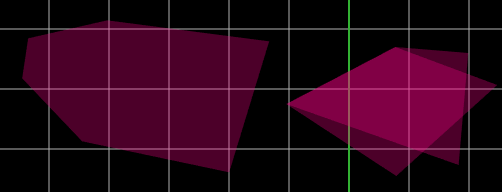
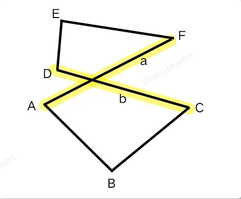
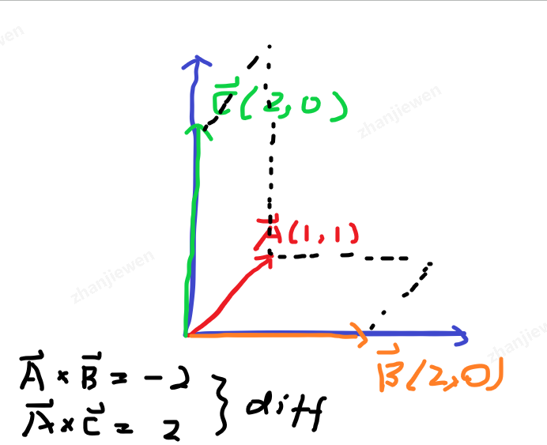

# 背景
我们在绘制区域时，通常会生成一个多边形（左1），但是如果一些顶点穿过了某条边时，会出现交叉的问题，此时产生复杂的多边形（右1）。


# 问题
如何判断是否有图形是否有重叠呢？

# 结论
判断顶点是否在线段两侧，从而可以判断线段是否能相交。

举例：


点*A*，点*F*组成的线段**a**与点*C*，点*D*组成的线段**b**相交。线段**a**的两个端点*A*，*F*必然在线段**b**的两侧，反之亦然。

如何判断顶点是否在线段两侧呢？

答：利用向量叉积(Cross product)来简化几何运算。
（叉积在二维计算上的结果是具有方向含义的）

步骤：有两条线段
1. 选择一条线作为中线；
2. 将中线端点与另一条线段的两个顶点连接做出辅助线；
3. 将辅助线与中线计算，如果符号相同说明在两侧，线段相交。
4. 选择另一条线作为中线，重复1-3

# 数学计算
首先，先了解一下二维叉积公式

$$\vec{a} \times \vec{b} = 
\left[\begin{array}{cc}
x_a & x_b \\
y_a & y_b
\end{array}
\right]
=x_ay_b - x_by_a
$$

其几何意义为：数值上是以两个向量为边的平行四边形面积（这里你可以手写一下看看，例如有两个顶点(1, 1) 和 (2, 0)，用纸和笔计算一下），符号可以标识方向。



计算得到的面积符号不同，表示为：向量**B**和向量**C**在向量**A**的两边。

所以在每次绘制的点的时候，都可以尝试计算顶点之间的位置关系，做出判断。

但是，还有一个关键因素：需要反向计算一次。
如果只算一个，延长线可以相交，但实际并不一定有相交。

# C++代码
```cpp
double crossProduct(const Vector3d v1, const Vector3d v2)
{
    return v1.x() * v2.y() - v1.y() * v2.x();
}

bool isIntersection(const Edge &baseEdge, const Edge &targetEdge)
{
    Vector3d basePointA = baseEdge.first;
    Vector3d basePointB = baseEdge.second;

    Vector3d targetPointC = targetEdge.first;
    Vector3d targetPointD = targetEdge.second;

    Vector3d vBase(basePointA.x() - basePointB.x(), basePointA.y() - basePointB.y(), 0);
    Vector3d vBaseC(basePointA.x() - targetPointC.x(), basePointA.y() - targetPointC.y(), 0);
    Vector3d vBaseD(basePointA.x() - targetPointD.x(), basePointA.y() - targetPointD.y(), 0);

    return crossProduct(vBase, vBaseC) * crossProduct(vBase, vBaseD) <= 0;
}

bool isComplexPolygon(const std::vector<Vector3d> &points)
{
    int length = points.size();
    if (length < 6) return false;  // 6个点，3条边

    vector<Edge> edges;

    // 根据顶点生成边
    for (int i = 0; i < length; i += 2)
        edges.push_back({points[i], points[(i + 1)]});

    int edgesLength = edges.size();
    auto extractArray = [&](int startIndex, int indexEnd) {
        vector<Edge> tmp;

        for (int i = 0; i < indexEnd; ++i)
            tmp.push_back(edges[(startIndex + i) % edgesLength]);

        return tmp;
    };

    // 逐边判断，相邻边无需判断
    for (int i = 0; i < edgesLength; ++i) {
        // 解释一下：edgesLength - 3的原因
        // 3 表示 当前边，以及它相邻的两条边
        // edgesLength - 3 则表示为 除去这三条边，其他所有不相邻的边的索引值范围
        vector<Edge> nonAdjcentEdge = extractArray(i + 2, edgesLength - 3);
        for (const auto& edge : nonAdjcentEdge) {
            if (isIntersection(edges[i], edge) && isIntersection(edge, edges[i])) {
                return true;
            }
        }
    }
    return false;
}
```
https://juejin.cn/post/7088872003582558216


在实际的工作中，逐个点组合成边，然后在进行判断比较耗时间。

为了节省时间，可以考虑把放置好的元素直接生成好边，这样只需要遍历边元素就可以了。


